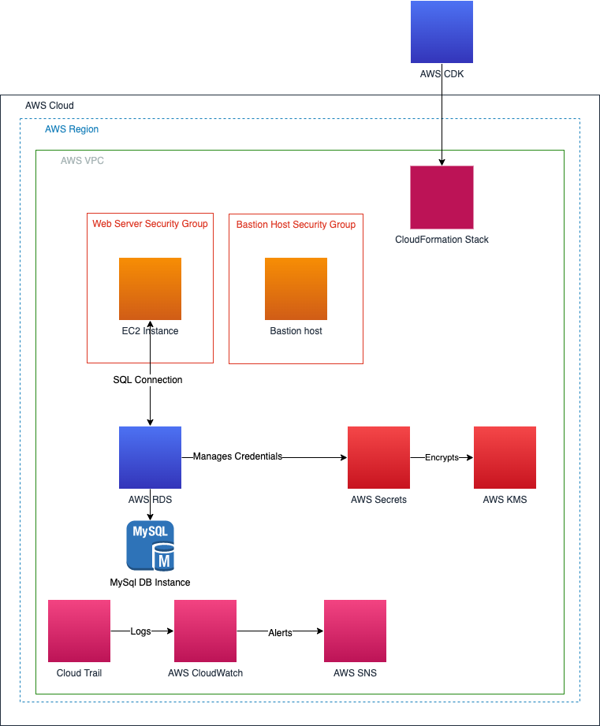

> # Welcome to the CDK Lab Python project!

  

## CDK Code Examples
This group of example code written in Python, introduces you to AWS CDK concepts for building, deploying and automating the build of a common AWS Environment. The code examples build the basic framework for a highly available environment for deploying a web application like Joomla. 

The Pattern uses [NestedStack](https://docs.aws.amazon.com/cdk/api/latest/docs/@aws-cdk_aws-cloudformation.NestedStack.html), which are stacks created as part of other stacks. This Pattern the resources in the templates to reference other templates, creating nested stacks. 

Before deploying stack, the values in `cdklab/config/stack_config.py` must be configured

## Prerequisites 

1. An active AWS account

2. AWS Command Line Interface (AWS CLI), installed and configured. For more information about this, see [Installing, updating, and uninstalling the AWS CLI in the AWS CLI](https://docs.aws.amazon.com/cdk/latest/guide/getting_started.html) documentation. 

3. AWS Cloud Development Kit (AWS CDK) Toolkit, installed and configured. For more information about this, see [AWS CDK Toolkit (cdk command)](https://docs.aws.amazon.com/cdk/latest/guide/cli.html) in the AWS CDK documentation.

# Useful CDK commands - [Working with the AWS CDK in Python](https://docs.aws.amazon.com/cdk/latest/guide/work-with-cdk-python.html)
* python -m ensurepip --upgrade
* python -m pip install --upgrade pip
* python -m pip install --upgrade virtualenv

* source .venv/bin/activate
* python -m pip install -r requirements.txt

## Deployment

[CDKLab](https://gitlab.aws.dev/rwawssec/cdklab)

## Target architecture 

##  cdklab/config/stack_config.py
> Config Parameters for development stages, regions, accounts, ec2 keys, kms required services and A parametrized array of pipelines for deployment. 
> **_Required Configuration: Accounts and EC2_KEYS with your account information_**

## cdklab/cloudwatch_stack.py
> Stack that creates CloudWatch metrics, Alarm and Events Rule with a Target
- Creates a Metric from an existing Metric CPUUtilization, creates an alarm and sends notification to a SNS Topic
- Creates an Event Rule that monitors for Guard duty alerts and sends notification to a SNS Topic with a formatted message

## cdklab/compute_stack.py
> Stack that creates Compute resources that are launched from a Load Balanacer

- Bastion host for access in Public subnet and allows only port 22
- Application Load Balancer in Public subnet
- Auto Scaling Group in Public subnet that launches pre-defined AMI’s with desired_capacity=1, min_capacity=1, max_capacity=3 and allows only port 22 and 80
- Create Security Groups for connectign to RDS instances in Private subnet

##  cdklab/data_stack.py
> Stack that creates RDS Instance, encrypts the data with a CMK Key and creates Secrets manager Credentials

- Creates a KMS Key with Policy for encrypting RDS Data
- Creates an RDS MySQl Instance with Credentials provided by Secrets manager
- Creates a Mysql instance: version=rds.**MysqlEngineVersion.VER_8_0_28**

##  cdklab/infrastructure_stack.py
> Stack that creates VPC Infrastructure, Internet Gateway, public and private subnets, NAT Gateway
- Set the following Attributes in the stack_config.py:

  * cidr = 10.0.0.0/16
  * max_azs = 2
  * enable_dns_hostnames = True
  * enable_dns_support = True

## cdklab/kms_stack.py
> Stack that creates CMK KMS keys from a list for basic
- Functionality for most common services
  * kms:DescribeKey
  * kms:Encrypt
  * kms:Decrypt
  * kms:ReEncrypt
  * kms:GenerateDataKey

- Creates a KMS Key with Policy for encrypting AWS Services and assigning priviledges to manage
- The key list is configured form a list in the cdklab/config/stack_config.py, kms_services

##  cdklab/logging_stack.py
> Stack that enables CloudTrail that sends logs to S3 and CloudWatch and creates three SNS Topics for notification

##  user_data/user_data.sh
> Sample Script to setup EC2 instance with everything required to install a basic web server

